# kt cloud clib 프로젝트

## 목차
- [kt cloud clib 프로젝트](#kt-cloud-clib-프로젝트)
  - [목차](#목차)
  - [프로젝트 설치 및 실행](#프로젝트-설치-및-실행)
  - [폴더 구조](#폴더-구조)
  - [컴포넌트](#컴포넌트)
  - [common](#common)
    - [InputComponent](#inputcomponent)
    - [SelectBoxComponent](#selectboxcomponent)
    - [ButtonComponent](#buttoncomponent)
    - [AgGridComponent](#aggridcomponent)
    - [ChkBoxComponent](#chkboxcomponent)
    - [TextAreaComponent](#textareacomponent)
    - [LabelComponent](#labelcomponent)
    - [DatePickerComponent](#datepickercomponent)
    - [SubInfoTitle](#subinfotitle)
    - [DepthTitle](#depthtitle)
    - [DragGrid](#draggrid)
    - [FileInputComponent](#fileinputcomponent)
    - [linkComponent](#linkcomponent)
    - [PageTitle](#pagetitle)
    - [PagingComponent](#pagingcomponent)
    - [PopupComponent](#popupcomponent)
    - [RadioComponent](#radiocomponent)
    - [TabComponent](#tabcomponent)
    - [ag-cell-Render](#ag-cell-render)
    - [ag-cell-Render \> AutCdGpNm](#ag-cell-render--autcdgpnm)
    - [ag-cell-Render \> AutYn](#ag-cell-render--autyn)
    - [ag-cell-Render \> BillChageDiv](#ag-cell-render--billchagediv)
    - [ag-cell-Render \> HoliDesc](#ag-cell-render--holidesc)
    - [ag-cell-Render \> HoliDiv](#ag-cell-render--holidiv)
    - [treeComponent](#treecomponent)
    - [treeComponent \> msf-tree](#treecomponent--msf-tree)
    - [treeComponent \> msf-tree-item](#treecomponent--msf-tree-item)
    - [popupComponent](#popupcomponent-1)
    - [popupComponent \> BtExeInfoPopup](#popupcomponent--btexeinfopopup)
    - [popupComponent \> CdGpLstPopup](#popupcomponent--cdgplstpopup)
    - [popupComponent \> CdLstPopup](#popupcomponent--cdlstpopup)
    - [etc](#etc)
    - [etc \> AtcLstComponent](#etc--atclstcomponent)
    - [etc \> AtcRegComponent](#etc--atcregcomponent)
    - [etc \> FloatingLabelsComponent](#etc--floatinglabelscomponent)
    - [etc \> RangeComponent](#etc--rangecomponent)
    - [etc \> ToastComponent](#etc--toastcomponent)
    - [etc \> ValdtnComponent](#etc--valdtncomponent)
  - [](#)
  - [unionForm](#unionform)
    - [AutRetvComponent](#autretvcomponent)
    - [Blc2Component](#blc2component)
    - [BlcComponent](#blccomponent)
    - [CustInfoComponent](#custinfocomponent)
    - [CustRetvComponent](#custretvcomponent)
    - [FormDataComponent](#formdatacomponent)
    - [FormDataPopupComponent](#formdatapopupcomponent)
    - [PostCodeComponent](#postcodecomponent)
    - [RetvCondComponent](#retvcondcomponent)
    - [SubsRetvComponent](#subsretvcomponent)
    - [UserAdmRetvComponent](#useradmretvcomponent)
  - [VueX](#vuex)
  - [참고](#참고)

## 프로젝트 설치 및 실행
```
프로젝트 설치 : npm install
프로젝트 실행 : npm run serve
json-server  : json-server --watch info.json --port 8080
```

## 폴더 구조
```
clib
├── node_modules
├── public
├── src
│    ├── App.vue
│    ├── main.js
│    ├── components
│    │     ├── header.vue                     # 상단 헤더
│    │     ├── Nav.vue                        # 좌측 Nav바
│    │     ├── section.vue                    # 세션 - multi tab & Show Pages
│    │     ├── common                         # 공통 컴포넌트 폴더
│    │     │      ├── ★☆★☆.vue              # multiple vue component files
│    │     │      ├── agGridCellRender
│    │     │      ├── treeComponent
│    │     │      ├── popupComponent
│    │     │      └── etc                     # 아직 한 번도 쓰지 않은 컴포넌트
│    │     │
│    │     ├── autMappg                       #
│    │     ├── cont                           #
│    │     └── unionForm                      # 2개 이상의 common 컴포넌트가 조합 된 컴포넌트
│    │            └── ★☆★☆.vue              # multiple union vue form component
│    │
│    ├── pages                                # 각 메뉴 폴더명 미정
│    │     ├── 01                             # 고객/청약
│    │     ├── 02                             # 요금/수납/미납
│    │     ├── 03                             # 청구/정산/매출
│    │     ├── 04                             # 업무현황
│    │     ├── 05                             # 업무지원
│    │     └── 06                             # 공통
│    │  
│    ├── assets
│    │     ├── css
│    │     ├── img
│    │     └── fonts
│    │
│    ├── service  
│    │     ├── common.js                      # 공통 함수 ( axios 함수 등 )
│    │     └── formatService.js               # 공통 formating 함수 ( axios 함수 등 )
│    │
│    ├── store
│    │     ├── index.js
│    │     └── moudeuls                       # 각 메뉴에서 사용하는 vuex 모듈
│    │            ├── L01Store.js             # 고객/청약
│    │            ├── L02Store.js             # 요금/수납/미납
│    │            ├── L03Store.js             # 청구/정산/매출
│    │            ├── L04Store.js             # 업무현황      
│    │            └── L05Store.js             # 업무지원       
│    │
│    └── router
│          └── index.js
├── .idea
├── .gitignore
├── dist
├── babel.config.js
├── readMeImg                                # ReadMe 이미지 폴더 
└── README.md
```
***

## 컴포넌트
## common

**컴포넌트간 데이터 송수신**
```
- 송신 : this.$emit("emitValue",자식변수)  
- 수신 : @emitValue = "(자식변수)=> { 부모변수 = 자식변수}"
```

***
###  InputComponent
**props:**
- placeholder : 입력 전 예시 값
- type : 입력창의 타입 (ex. text, search)
- width : 입력창 가로 길이 (기본 : 150px)
- height :  입력창 세로 길이 (기본 : 20px)
- inputClass : 입력창 스타일 지정을 위한 클래스 (기본 : class1)
- disabled : 입력창 입력 불가 여부 (기본 : false)
- value : 입력창 값

**주요특징:**
- emit가 아닌 v-model을 통해 데이터 송수신
- 입력창 스타일 (`class1`, `class3`, `class4`, `class5`, `class6`)
***
### SelectBoxComponent
**props**
- selectedValue :
- cdGroup       : 선택 사항(option) 지정하는 변수
- selectClass   : 셀렉트박스 스타일 지정을 위한 클래스
- defaultValue  : 기본 선택 사항을 지정하는 변수(placeholder 역할)
- defaultcdId   : 기본 선택 값(코드)을 지정하는 변수    ( cdId)
- selectedValue : 부모 컴포넌트에서 선택 된 데이터를 전달받아 출력하기 위한 변수
- width         : 가로 크기 지정 ( 기본 값 : 100%)
- height        : 세로 크기 지정 ( 기본 값 : 100%)
- isDisabled    : 셀렉트박스 선택 사항 클릭 시, 기본 선택 사항(placeholder) 선택 불가 및 hidden 처리에 대한 여부
- selectType1MarginLeft : 셀렉트박스 스타일 클래스 select-type1에 margin-left 적용  ( default : 10px)

**emit:**
- emitValue : 선택 값의 code를 부모 컴포넌트에게 반환.
- width, height 기본 값으로 부모 tag의 100%로 지정되어 있기때문에 별도의 props( :width, :height )로 사이즈 지정 필요.

**주요특징:**
- 예시

<p align="center">
  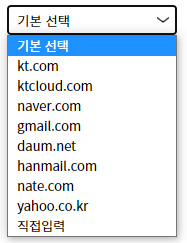 &nbsp;
  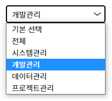&nbsp;
</p>

- 1) disabled : false --> 특정 값 선택에도 기본 값(기본 선택) 선택 가능
- 2) defaultcdId 지정 시, 처음 기본 값을 해당 코드를 가진 값 (예시에서 **개발관리**) 출력.
사용자관리(UserAdm.vue) 데이터 클릭부터 출력까지의 로직 참고


<p align="center">
  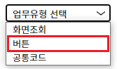
  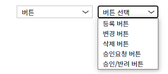
</p>

- disabled : true --> 특정 값 선택 시, 기본 값(업무유형 선택) hidden 처리 및 선택 불가
- optional 셀렉트 박스 ( 목록 중 **버튼** 선택 시, 두번째 박스 활성화 ) 
두번재 select box에서 첫번째 셀렉트박스의 emitValue에서 받는 변수 조건문에따라 출력

*** 
### ButtonComponent

**props:**
- btnClass : 버튼의 스타일 지정 클래스
- btnName : 버튼의 이름
- btnWitdh : 버튼 가로 크기 (지정안할 시 기본 값 25px)
- btnHeight : 버튼 세로 크기 (지정안할 시 기본 값 25px)
- btnFontWeight : 버튼 이름 굵기 (지정안할 시 기본)

**주요특징:**
- 버튼 스타일 (`btnClass1`, `btnClass2`,`btnClass3`, `btnClass4`)

***
### AgGridComponent
**props:**
- rowData       : (중요 1) row에 들어갈 데이터 지정
- columnDefs    : (중요 2) column에 들어갈 데이터 지정 및 설정
  - [headerName : 컬럼 헤더 이름, filed: rowData의 데이터 key 값, width : 너비  등 지정]
- gridOptions   : 합계에 사용 ?
- rowClicked    : 행 클릭 이벤트
- noWidthScroll : 가로 스크롤 표시하지 않는지 (true:스크롤 표시하지 않음 / false:스크롤 표시(기본 값) )
- isAutoHeight  : 세로 스크롤 표시하는지
- isAutoSize    : ag-grid 감싸고 있는 박스 크기에 맞출지 여부 및 타입 결정하는 배열 데이터 [Boolean, String]
  - isAutoSize[0] = 감싸고 있는 박스 크기에 자동 fit 하는 함수 사용할 것인지에 대한 boolean 값 ( true: 동의, false: 거부. columnDefs에서 지정한 wiedth에 맞춘 크기 사용)
  - isAutoSize[1] = 자동 fit 하는 함수 사용하지 않을 경우(columnDefs에서 지정한 width에 따라 출력할 경우), 타입 선택 ( type 1, 2,3 )
- isDeselect    : 여러 row 클릭 가능하게 할 지 여부 (여기서 기능은 같은 row를 2번 클릭하면 해당 row 클릭 해제가 됩니다.)
- headerColor   : column 헤더의 색 지정
- headerHeight  : column 헤더의 높이 지정
- rowHeight     : row 높이 지정
- overlayNoRowsTemplate : rowData 없을 경우 출력되는 기본 메세지 템플릿

**주요특징:**
- clib에서 사용되는 테이블에 거의 모두 AgGrid 사용
- emit은 따로 없지만, 각 페이지 컴포넌트에서 rowClick 시 param을 매개변수로 받을 수 있어 해당 함수를 사용하여 데이터를 받아옵니다.
- isDeselect = true 일 경우, 클릭 했던 row 클릭 취소 가능
- columnDefs에서 컬럼명, 너비, css style 클래스 등 다양한 속성 사용 가능.


**ag-grid 호출 1)**
```

<ag-grid-component
  :rowData="testRowData"                                # rowData 객체
  :columnDefs="testColumnDefs"                          # 컬럼 속성 정의 객체  
  :rowHeight="testRowHeight"                            # 각 row의 높이 지정
  :isDeselect="true"                                    # 여러 row 클릭 가능하게 할 지 여부
  :isAutoSize="[false,'type1']"                         # [박스 크기에 맞출지 여부(bool), 타입(type 1, 2, 3)] 결정하는 배열   | 박스 크기에 맞춘다면 해당 props default값 으로 지정 ( 아래 ag-grid 호출 2 참고 )
  :headerHeight="60"                                    # header row의 높이
  :rowClicked="testLstRowClicked"                       # row 클릭 시, 실행시킬 함수 지정
  :overlayNoRowsTemplate="noRowTemplateMsg"             # rowData가 없을 경우 출력 할 템플릿 
  />

------------------------------------------------------------------------------------
참고 파일 : commonView2.vue 


```

**예시**
<p align="left">
  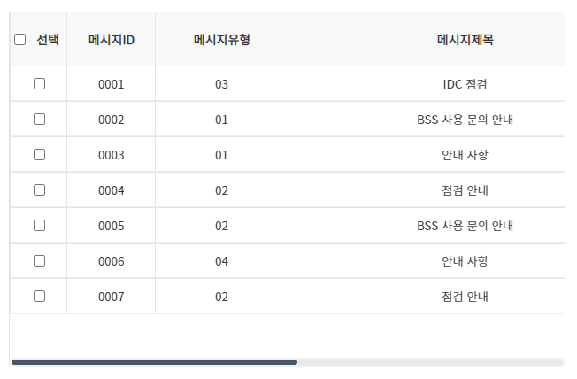
  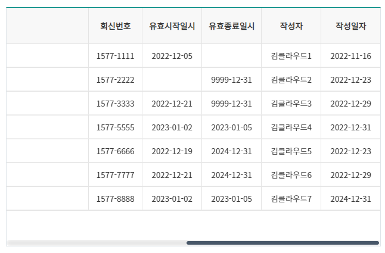 &nbsp;
</p>


**ag-grid 호출 2)**
```

<ag-grid-component
  :header-color="'rgb(239 245 252)'"         # header Color 지정
  :rowData="testRowData"                     # rowData 지정
  :columnDefs="testColumnDefs"               # columnDefs 지정
  :row-height="40"                           # 각 row 높이 지정
  :overlayNoRowsTemplate="noRowTemplateMsg"  # rowData가 없을 경우 출력 할 템플릿 
/>
-------------------------------------------------------------------------------
참고 파일 : commonView2.vue 
```

**예시**

<p align="center">
  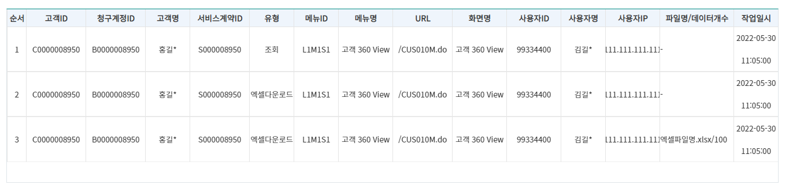 &nbsp;
</p>


***
### ChkBoxComponent
**props:**
- CheckOptions : 체크박스로 보여줄 데이터 배열
- showCheckOpt : 체크된 내역 출력 여부
- checkTextSize : 체크박스 글자 크기
- checkBoxSize : 체크박스 박스 크기
- chkBoxColor : 체크박스 색상

**emit:**
- 현재 설정 안되있음

**주요특징:**
- 누른 순서대로 checkedValues 변수에 들어간다.
***
### TextAreaComponent
**props:**
- contents      : 글 작성 내용. 기본 값/변경 있을 경우 해당 props값 출력
- placeholder   : contents가 비어있을 때, 해당 값 출력
- maxlength     : 글자 길이 최댓값
- textAreaHeight: textArea의 높이 지정
- textAreaWidth : textArea의 너비 지정

**주요특징**
- textAreaData 변수에 값이 없을 경우 placeholder props 값 출력
- textAreaData 변수에 기본 값 or 변경 있을 경우 해당 값 출력
- v-model : 해당 변수(textAreaData)에 연결하여 입력 값에 따라 동기화
- contents : 해당 변수 값을 textArea컴포넌트로 전송하여 출력.

**호출 코드**
```
<TextAreaComponent
  :textAreaHeight="'200px'"               # textArea 컴포넌트 높이
  :placeholder="'내용 입력'"
  :maxlength="200"                        # 최대 입력 글자 수
  :contents="msgContent"                  # 입력 내용을 자식 컴포넌트에 전달 
  v-model="msgContent"                    # 입력 내용 데이터 바인딩
/>
```

**예시**

<p align="left">
  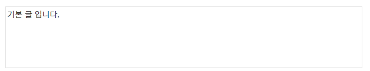 &nbsp;
</p>


***
### LabelComponent
**props:**
- labelNm : 라벨 이름
- labelClass : 라벨의 스타일 지정 클래스

**주요특징:**
- 주로 table의 th 부분에서 많이 사용됨.

***
### DatePickerComponent

**props:**
- classWrapper            : DatePicker css  클래스 지정 (기본 값 유지)
- calenderBackgroundColor : 배경색 지정 ( 기본 값: white)
- pDate                   : 특정 출력 날짜 지정
- isMinDate / isMaxDate   : 최소 / 최대 날짜 : 두 날짜 선택 시, 두 날짜 내의 기간만 선택 가능
- width                   : DatePicker 너비 지정 (기본 값 : 140px)
- height                  : DatePicker 높이 지정 (기본 값 : 34px )
- pPlaceholder            : 날짜 지정 안했을 경우 출력할 날짜 혹은 문구
- dateFormat              : 출력 날짜 형식 지정 ('yyyy-MM', 'yyyy-MM-dd', 'yyyy-MM-dd HH:mm' )
- type                    : 월력/일력/시분 지정 ( month, day, time )
- timeShow                : 일력 출력 2번째 방법

**emit:**
- this.$emit("emitValue", value); : emitValue라는 이벤트로 해당 date 부모 컴포넌트에게 전달.

**주요특징:**
- [ref] https://icehaunter.github.io/vue3-datepicker/config.html#props
-  date picker는 block형식이므로 두 개의 date picker 사용 시, inline-block 또는 flex 사용 해야합니다.
- background color, width, height 설정으로 크기 및 색상 조절
- emitValue로 date-picker에서 변경한 날짜 값을 data 변수에 저장 필요.
- x버튼 (clear) 클릭 시, pPlaceholder로 설정한 값을 표시
- type props를 이용해서 월/일/시분 력 선택 가능
- isMinDate / isMaxDate 를 이용해서 특정 날짜 구간 지정 가능 ( 두개의 props 모두 사용해야 가능합니다.)

**호출 코드**
```
<date-picker-component
  :width="150"                                  # 가로 길이 
  :dateFormat="'yyyy-MM'"                       # 데이터 출력 형태 (yyyy-MM-dd , yyyy-MM-dd HH:mm)      
  :type="'month'"                               # 월력(month), 일력(date), 시간(time)  
  :pPlaceholder="'2022-12-25'"                  # 날짜 공백 시 출력하는 일자 
  :p-date="date"                                # 특정 일자 지정
  :isMinDate="new Date('2023.01.03')"           # 제약 - 기한 시작 날짜 
  :isMaxDate="new Date('2023.01.15')"           # 제약 - 기한 마지막 날짜 
  @emitValue="(value) => {date = value;}" # date-picker 컴포넌트로부터 선택 날짜 받아오는 emit 함수
  />
```

**예시**
<p align="center">
  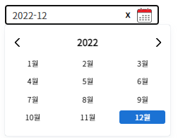 &nbsp;
  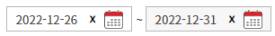
</p>
<p align="center">
  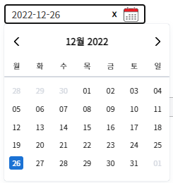&nbsp;
  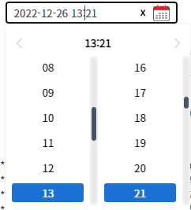&nbsp;
  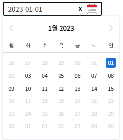 &nbsp;
</p>

***
### SubInfoTitle
**props:**
- subInfoTitleNm : 제목 명 지정
- subInfoTitle : 제목 스타일 지정 클래스
- fontSize : 제목 글자 크기

**주요특징:**
- 각 Object마다의 서브 제목으로 사용

***
### DepthTitle
**props:**
- currentMenu : 메뉴의 최상단 Depth부터 현재 보여줄 타이틀 제목까지 3Depth
***
### DragGrid
**props:**
- leftRowData : 첫번째 Row데이터 값
- leftTitle : 첫번째 Row의 제목
- rightRowData : 두번째 Row데이터 값
- rightTitle : 두번째 Row의 제목
- Columns : 첫번째 두번째 Row에 대한 공통 Columns 값
- headerColor : header 셀의 색상 지정
- overlayNoRowsTemplate : Row 데이터값이 없을 때 출력되는 문구

**주요특징:**
- 좌측에 위치한 드래그 버튼을 통해 Grid 간 데이터 이동 가능
- 확정 버튼을 통해 Grid 간의 이동을 확정한다.
- DragGrid의 경우 leftRowData에는 첫번째 Row데이터를 넣는다.
- rightRowData에는 두번째 Row데이터를 넣는다.
- Columns에는 공통으로 사용할 헤더정보를 넣는다.
- Gird간의 이동이 완료된 후에는 확정 버튼을 통해 이동된 Row데이터의 값을 바꿔줘야 한다.
- 헤더 색상의 경우 headerColor를 통해 변경 가능하다.
- overlayNoRowsTemplate는 데이터 값이 없을 때 보여주는 메시지를 지정한다.

**호출코드**
```aidl
<DragGrid
  :left-row-data="leftRowData"
  :right-row-data="rightRowData"
  :Columns="GridToGridColumns"
  :header-color="'rgb(113,156,205)'"
  :overlayNoRowsTemplate="
`<span> <br>` + '<br />조회 결과가 없습니다.' + ` </span>`"
/>
```

**예시**

-이동 전

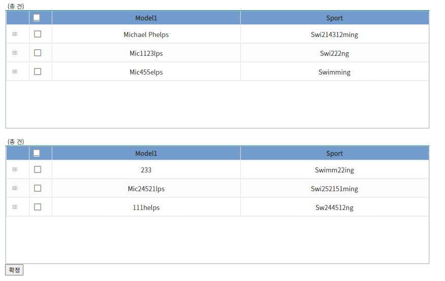

-이동 후

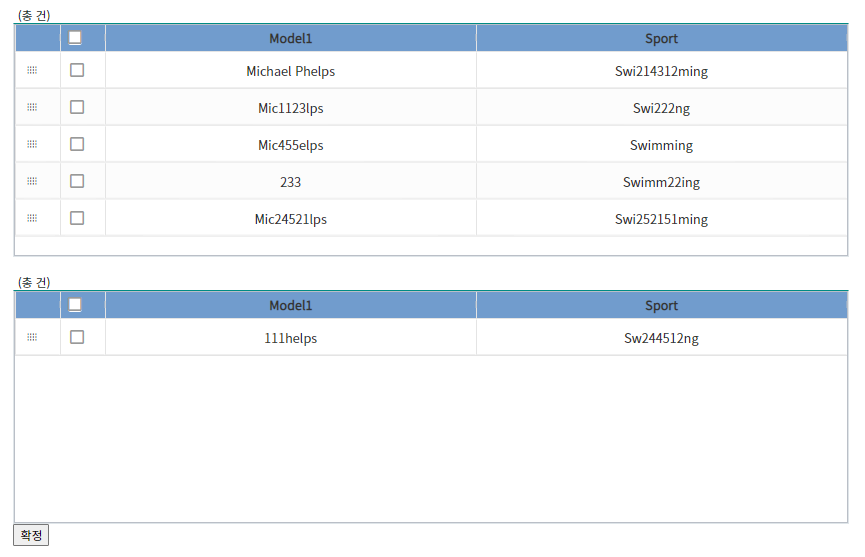

***
### FileInputComponent
**props:**
- atcNoti    : 파일 불러오기 박스 위 출력할 수 있는 안내 문구 (Strign)
- pPrevFiles : 이전 파일 목록
- isMultiple : 파일 다중 선택 가능 여부
- placeholder: 파일 불러오기
- pDisable : 파일 업로드 가능 여부

**주요특징:**
- 파일 업로드시, 파일명.확장자(크기) 로 출력
- 파일 업로드시, 업로드 불가 파일의 경우 팝업 생성
- 파일 업로드 후 x버튼 클릭 시, 해당 파일 삭제
- 파일 업로드 시 add로 파일 리스트에 추가 (초기화 X )
- 버튼을 통해 파일 업로드 가능 여부 상태 기능

**호출코드**
```
<file-input-component 
  :fileBoxWidth="'200px'" 
  :atcNoti="'버튼을 눌러 파일업로드 비활성화 가능'"
  :pDisable="pDisable"                               
  />
```

**예시**
<p align="center">
  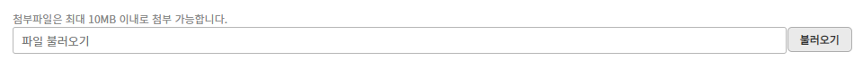 &nbsp;
</p>

***
### linkComponent
**props:**
- destination : 이동할 url
- linkNm : 링크명
- textsize : 글자 크기

**주요특징:**
- hover 시 파란색 글자에 밑줄이 생긴다.
- LinkComponent의 경우 destination 옵션을 통해 이동할 url을 지정할 수 있다.

**호출 코드**
```aidl
      <link-component
          :destination="'/'"
          :linkNm="'링크 컴포넌트(mounse over)'"  />
```

**예시**
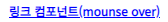 : 마우스 호버 상태

***

### PageTitle
**props:**
- currentMenu : Menu.json에 있는 메뉴 정보
- stateOfBookMark : 즐겨찾기 등록 여부

**emit:**
- stateOfBookMark 클릭 여부에 따라 false, true값 전달

**주요특징:**
- 각 페이지마다 보여지는 페이지 제목
- 아이콘을 통해 즐겨찾기 추가 가능, 추가시 아이콘 색상 변경
- PageTitle의 경우 currentMenu를 통해 현재 보여줄 타이틀 제목을 지정해줄 수 있다.
- stateOfBookMark의 경우 현재 즐겨찾기 여부를 지정한다.
- @stateOfBookMark의 경우 클릭에 따른 즐겨찾기 여부를 부모 컴포넌트에 전달하기 위해 사용

**호출코드**
```
<PageTitle
  :current-menu="currentMenu"
  :stateOfBookMark="false"
  @stateOfBookMark="stateOfBookMark = value"
  />
```

**예시**

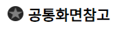 : default

 : 즐겨찾기 추가

***
### PagingComponent
**props:**
- pageSize     : 화면에 보여지는 페이지 개수
- pageableData : 페이지 객체 데이터
  - pageNumber  : 첫 페이지 지정
  - totalPages  : 전체 페이지 개수

**emit:**
- @currentPage :  현재 페이지(pageNumber)를 emit으로 부모에게 전달

**호출 코드**
```
<paging-component
  ref="PagingComponent"
  :pageableData="pageableData"                      
  :pageSize="10"                                    # pageSize : 한 화면에 출력 될 페이지 개수 지정
  @currentPage="(value) => {currentPage = value;}"  # 현재 페이지 emit으로 자식 컴포넌트에서 전송받음.
/>
------------------------------------------------
pageableData: {
  pageNumber: 1,
  totalPages: 16,
},

```

**예시**

<p align="left">
  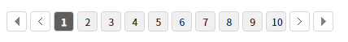 &nbsp;
  <span> pageSize = 10 , 한번에 10개 페이지씩 출력 </span>
</p>


<p align="left">
  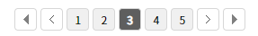 &nbsp;
  <span> pageSize = 5 , 한번에 5개 페이지씩 출력 </span>
</p>

***
### PopupComponent
**props:**
- popupOverlay : 팝업창 이외의 영역에 대한 스타일 지정
- popupmsg : 팝업창에서 보여줄 메세지 지정
- closeFunc : 'popup' 이아닌 다른 값 입력시 팝업창 이외의 영역 클릭시에도 창 안 닫힘
- isCancel : 현재 비활성화 시킨 기능 -> 엔터로 닫기 가능한 기능과 관계 있음.

**emit:**
- @popup : 취소 버튼 클릭 시 호출 되어 창을 닫을 수 있게 변수에 false값 전달
- @AGREE : 확인 버튼 클릭 시 변수 전달은 없지만 연결된 함수 호출

**주요특징:**
- v-if를 통해 팝업 출력 여부를 결정
- @AGREE에 함수 입력해야 확인버튼 클릭시 함수 호출 가능
- poupOverlay를 별도로 입력하지 않을 시 팝업창 이외 영역 클릭시 창 닫힘

**호출코드**
```
<popup-component
  v-if="isModalShow"
  @popup="isModalShow = false"
  @AGREE = "''"
  :popupmsg="'여기가 팝업 메세지 '"
  />
```


**예시**

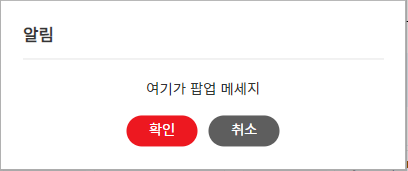


***
### RadioComponent
**props:**
- RadioOption   : 라디오 선택 리스트(옵션) 지정
- selectedRadio : 라디오 데이터 값 변경 시 적용하는 props
- defaultcdId   : 기본 값 적용 시 출력하는 props

**emit:**
- @radioValue : 선택 값의 code (cdId)를 부모 컴포넌트에 전달

**호출코드**
```
<radio-component 
  :RadioOption="'useNouse'"                               # radio 선택 옵션 메뉴 지정  
  :defaultcdId="isShowYn"                                 # 기본 선택 값(코드 값) 지정
  :selectedRadio="isShowYn"                               # 변경 된 선택 값 컴포넌트에 반영(props)
  @radioEmit="(radioValue) => { isShowYn = radioValue }"  # 반영 된 값의 코드 값 반환 
  />
```

**예시**
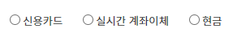 &emsp; - 기본 선택 값 (defaultcdId ) 미지정

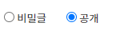&emsp;&emsp;&emsp;&emsp;&emsp;&emsp;&emsp;&emsp;&emsp;&emsp; - 기본 선택 값 (defaultcdId ) 지정 


***
### TabComponent
**props:**
- menuType : 탭으로 불어와야될 폴더이름
- compArray : 컴포넌트 값을 넣는 배열
- compValue : 처음 보여줄 컴포넌트의 주소
- compName : 현재 컴포넌트의 menuId


**주요특징:**
- 특정 페이지에서 사용되는 컴포넌트 내부의 탭을 추가하여 탭마다 각기 다른 컴포넌트 호출
- 다른 탭으로 이동해도 기존 탭 상태 유지
- 메뉴나 버튼 클릭을 통해 탭을 추가함

**호출코드**
```aidl
      <TabComponent
          :menu-type="'Cont'"      <- 폴더명
          :comp-array="compm"
          :comp-name="comp"
          :comp-value="component"
      />
```


**예시**

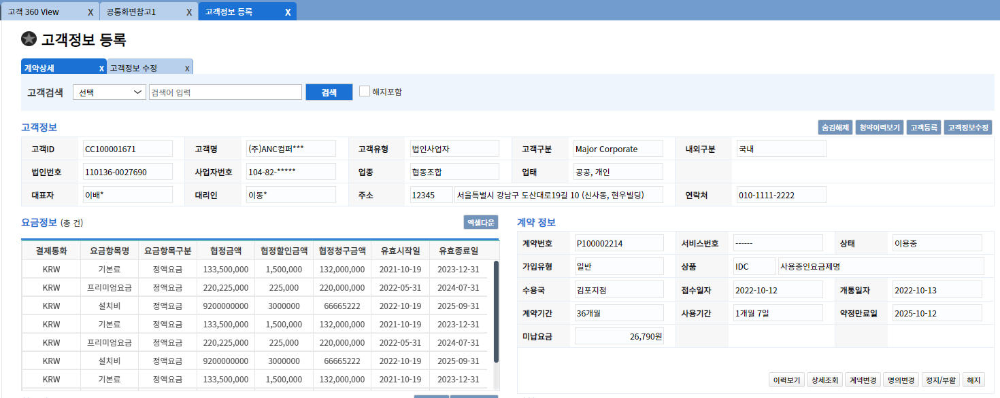


***
### ag-cell-Render
```
- Ag-Grid 내부 cell에 글자가 아닌 input, selectBox, button 등의 컴포넌트를 넣기 위한 문법
- 데이터를 반환받을때는 cellRendererParams를 통해 데이터를 반환 받는다.
```

**호출코드**
```aidl
        <ag-grid-component
            :rowData="renderRowData"
            :columnDefs="renderColumns"
            :row-height="40"
        />
------------------------------------------------------------------
        renderColumns:[
        {headerName:"AutCdGpNm" , field:"model1",
          cellRenderer :'AutCdGpNm',           <- AutCdGpNm 컴포넌트 렌더
          cellRendererParams: {                <- 컴포넌트 렌더에 대한 반환값
            clicked: function (field) {
              console.log(field);
            }
          },
          width: 250
        },
      ],
------------------------------------------------------------------      
      -AutCdGpNm.vue-
      this.params.clicked(this.cdGpValue);      <- cellRendererParams와 매칭

```
**예시**

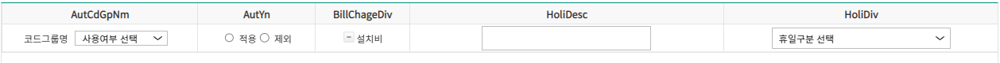

### ag-cell-Render > AutCdGpNm
- Rowdata의 필드값이 코드그룹일 경우 코드그룹 셀렉트 박스 출력
- 코드그룹이 아닐 경우 RowData에 들어간 값 출력

**예시**

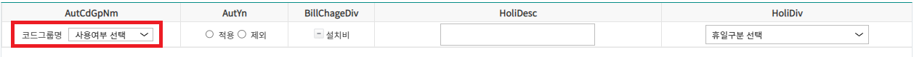

### ag-cell-Render > AutYn
- 라디오 박스형태 데이터 출력
- 적용, 비적용 라디오 박스 형태로 출력되고 둘중 하나의 값만 선택 가능

**예시**

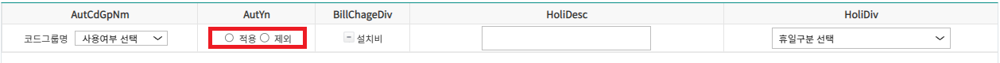

### ag-cell-Render > BillChageDiv
- 버튼 형태의 데이터와 내용 출력
- 버튼 클릭시 +, - 아이콘 변경

**예시**

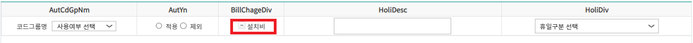

### ag-cell-Render > HoliDesc
- 내용을 적을 수 있는 input박스 출력
- 휴일관리 페이지에서 사용되었기에 휴일일 경우 빨간색 글씨로 출력

**예시**

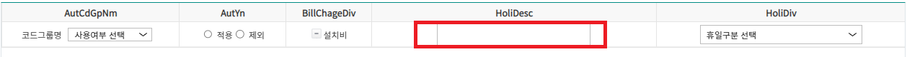

### ag-cell-Render > HoliDiv
- 휴일구분 선택 셀렉트박스 출력

**예시**

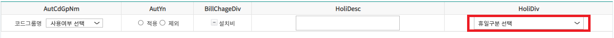

***
### treeComponent
```
- JSON 형태의 데이터를 입력받아 트리 형태로 보여주기 위한 컴포넌트 입력값에 따라 뱃지 형태의 라벨 출력 가능
- 현재 1depth 형태로 사용중에 있음.
```

### treeComponent > msf-tree
**props:**
- source : 트리에 넣을 데이터
- idFiled : source에 있는 데이터 중 id 필드
- labelField : source에 있는 데이터 중 출력할 필드명
- isBadgeShow : 우측에 위치한 배찌를 보여줄건지에 대한 값 true/false
- filterFunction : 함수를 값으로 받는다. 받은 함수에 각 행의 데이터를 매개변수로 보낸후 필터를 통해 통과하면 true 실패하면  false를 반환 false일 경우 출력내용에서 제외된다.
- expandDepth : 트리의 최대 깊이

**emit:**
- itemClick 함수를 통해 클릭된 행에 대한 데이터를 가져오고 @itemClick과 연결된 함수를 통해 후처리
- itemDblClick 함수를 통해 +, - 버튼을 눌러 트리 구조 처럼 행을 접었다 필수 있음.

**주요특징:**
- 트리를 출력하는 부분이 아닌 트리생성을 위한 데이터를 가공하고 처리하는 컴포넌트
- source에 들어갈 데이터는 json 형태의 데이터로 children 필드의 값이 하위 트리가 된다.
- labelFiled에 들어간 필드명이 트리의 내용이 된다.
- @itemClick과 연결된 함수에서 클릭된 트리에 대한 행 데이터와 후처리가 가능하다.
- filterFunction은 출력된 내용중 필터를 통해 출력할 내용을 정하는 것으로 함수는 트리를 호출하는 곳에서 정의한다. 반환값은 true/ false이고 매개변수로는 각행에대한 데이터를 받는다.
- 뱃지의 경우 데이터의 필드 중 chk와 chk2의 true/false에 따라 출력된다.

**호출코드**

```aidl
      <msf-tree :source="contentTree"
                label-field="directoryName"
                ref="tree"
                @itemClick="(value)=>{treeItemClick = value}"
                style="width:100%; height:100%;font-size: 12pt;"
      ></msf-tree>
```

**예시**

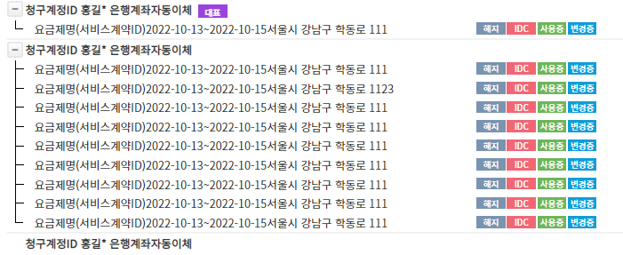

### treeComponent > msf-tree-item
- msf-tree에서 가공된 데이터를 기반으로 트리를 만들어 출력하는 컴포넌트

***
### popupComponent
```
- 확인 취소 뿐만이 아닌 Form 형태를 지니고 있는 Popup 입력창 혹은 정보를 출력하는 형태로 구성되어 있다.
```

***
### popupComponent > BtExeInfoPopup
- 배치 실행 내역을 보여주기 위한 팝업창
- 클릭시 팝업이 나오고 DB와 통신후 배치실행에 대한 스탭과 파라미터 출력
- 정보를 보여주기 위한 팝업이라 별도의 확인버튼은 존재하지 않는다.
- 정보의 경우 전달된 value를 통해 팝업 내부에서 axios통신을 통해 DB에서 받아 출력

**호출코드**
```aidl
      <BtExeInfoPopup
          v-if="isModelBtExeInfoShow"
          :value="null"
          @close="closeBtInfoModal"
      />
```

**예시**


***
### popupComponent > CdGpLstPopup
- 코드그룹 리스트 등록 변경을 위한 팝업창
- Type값 1/2에 따라 등록 변경으로 전환
- 변경이 될 경우 input 태그 중 disabled 처리된 부분 생성
- value의 경우 Json 형태의 데이터를 받는다.
- 등록의 경우 @submit와 연결된 함수가 실행되고 변경의 경우 @update에 연결된 함수가 실행된다.

**호출코드**
```
      <CdGpLstPopup
          v-if="isCdGpModalShow"
          :type="1"
          :value="null"
          @close="closeCdGpModal"
          @submit="''"
          @update="''"
        />
```

**예시**


***
### popupComponent > CdLstPopup
- 코드 리스트 등록 변경을 위한 팝업창
- 코드그룹 리스트 팝업과 방식은 동일

**호출코드**
```aidl
      <CdLstPopup
          v-if="isCdLstModalShow"
          :type="1"
          :value="null"
          @close="closeCdLstModal"
          @submit="''"
      />
```

**예시**

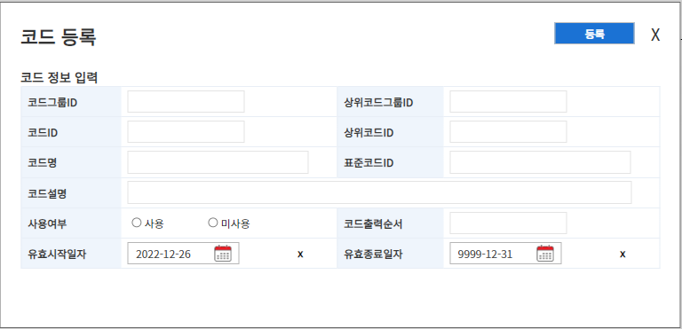

***
### etc
```
- 공통 기능으로 만들어놨지만 현재 페이지 시안을 만들면서 아직 사용하지 않은 컴포넌트
```

***
### etc > AtcLstComponent
**props**
- WrkjobNm : 첨부파일 목록 제목
- data : 파일유형, 등록일자, 파일, 비고로 이루어진 데이터

**주요특징**
- 목록을 보여주는 용도로 사용될 컴포넌트
- 추후 파일명 클릭시 다운로드 가능하도록 수정할 예정

**호출코드**
```aidl
 <AtcListComponent
    :WrkjobNm="'업무명들어갈자리'"
    :data="data"
 />
```

**예시**

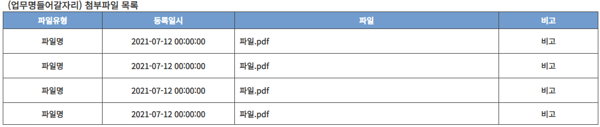

***
### etc > AtcRegComponent
**props**
- WrkjobNm : 첨부파일 등록 제목
- data : 파일유형, 필수여부로 이루어진 데이터

**주요특징**
- 첨부파일을 받아야되는 페이지에서 사용될 컴포넌트

**호출코드**
```aidl
<AtcRegComponent
    :WrkjobNm="'업무명들어갈자리'"
    :data="data"
/>
```

**예시**

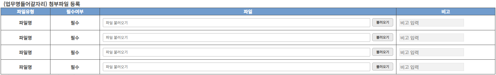

***
### etc > FloatingLabelsComponent
**props**
- placeholder : active 되지 않은 상태의 글자
- value : 사전에 입력할 글자
- maxlength : 입력되는 글자 최대 크기
- type : 입력창의 종류 (text, password)
- textColor : 입력되는 글자 색상
- lineColor : 밑줄의 색상
- closeBtnColor : x 표시의 색상
- placeholderColor : active 되지 않은 상태의 글자 색상
- fontSzie : 글자 사이즈 지정
- textOffsetBot : 밑줄과의 간격을 조정하기 위한 margin-top 값

**emit**
- @emitValue를 통해 입력값 변수로 전달 받는다.

**주요특징**
- x를 누르면 자동으로 다시 입력탭에 포커스가 된다.
- input 컴포넌트 대신 사용 가능, 사용시 위로 플로팅 되는 부분까지 생각하여 폼 구축 해야함.

**호출코드**
```aidl
      <FloatingLabelsComponent
        :placeholder="'입력'"
        @emitValue="(value) =>{data = value}"
      />
```

**예시**

-입력 전

-입력 후
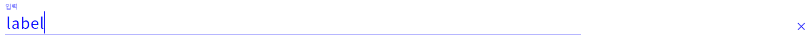

***
### etc > RangeComponent
- 슬라이더를 통해 범위 조절이 가능한 컴포넌트

**호출코드**
```aidl
<RangeComponent />
```

**예시**
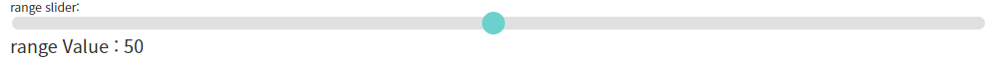

***
### etc > ToastComponent
**props**
- id : Toast 메시지에 대한 고유한 값
- className : 배경색을 지정하기 위한 클래스(wk-alert, wk-warn, wk-info)
- horizontalPosition : 세로 위치 지정을 위한 값 (top, bottom)
- verticalPosition : 가로 위치 지정을 위한 값(left, right)
- transition : 애니메이션을 위한 transition name 지정을 위한 값('slide-down', 'slide-up', 'slide-left', 'slide-right', 'fade')
- duration : 자동 삭제 시간
- message : 메시지에서 보여줄 값
- closeable : 클릭으로 삭제할지에 대한 true/false

**주요특징**
- 출력 위치 조절가능
- className에 따라 스티커 색상 변경 가능
- 일정 시간 뒤 자동 삭제 가능
- position값 조정해서 출력 위치 조정 가능
- duration값 조정해서 일정 시간 뒤 자동 삭제
- 클래스 지정 방식은 입력받은 postion값을 wk-{position}의 형태로 만든후 join하여 class변수에 입력
- className : wk-alert ,wk-warn, wk-info  
- transition : 'slide-down', 'slide-up', 'slide-left', 'slide-right', 'fade'

**호출코드**
```aidl
      <ToastComponent
          v-if="chk"
          :message="'hello'"
          :vertical-position="'bottom'"
          :horizontal-position="'right'"
          :class-name="'wk-info'"
          :closeable="true"
          :duration="2000"
          :transition="'slide-right'"
      />
```

**예시**


***
### etc > ValdtnComponent
- 가져다 쓰는 컴포넌트보다는 사용법에 대한 예시 컴포넌트
- 사용시 form태그로 입력 영역을 묶어야 한다.
- 등록, 확인 등의 버튼은 정합성이 다 통과되야 홣성화 된다.

**예시**

-입력 전

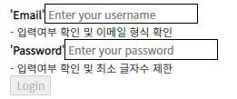

-입력 후 에러및 에러메시지

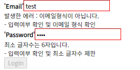

-정상 입력

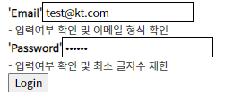
---

***
## unionForm
```
- 하나의 컴포넌트가 아닌 다양한 컴포넌트를 조합하여 검색폼 or 입력폼을 만든 컴포넌트
- 자세한 형태는 공통화면의 조합화면참고
```

***
### AutRetvComponent
- 권한 매핑 관리 페이지의 메뉴권한, 컴포넌트 권한, 조직권한, 사용자권한 컴포넌트에서 검색에 사용하는 조회 폼
- title : 제목명
- selDefaultValue : 셀렉트 박스 기본 값
- cdGroup : 셀렉트 박스에 넣을 데이터에 대한 코드그룹
- @input : 컴포넌트 내의 값들을 받기 위한 함수

**호출코드**
```aidl
      <aut-retv-component
          :title="'조회기준'"
          :sel-default-value="'조회기준 선택'"
          :cd-group="'orgBase'"
          @input="(value)=>{
        this.selectValues.searchValue = value[0];
        this.selectValues.selValue = value[1];
      }"
      />
```

**예시**
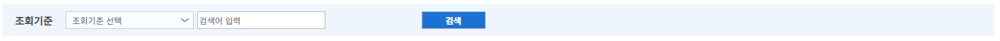

***
### Blc2Component
- 청약리스트 페이지에서 검색 폼 밑에 존재하는 청약리스트 테이블 폼
- subInfoTitleNm : 해당 오브젝트에 대한 제목명
- rowData : Ag Grid에 들어갈 행 데이터
- columnDefs : Ag Grid에 들어갈 컬럼 데이터
- selectBoxShow : 셀렉트 박스 출력 여부
- agGirdHeight : Ag Grid 셀의 높이
- cdGroup : 셀렉트 박스에 넣을 데이터에 대한 코드그룹
- btnName1~3 : 버튼 3개에 대한 버튼명

**호출코드**
```aidl
        <blc2-component
            :sub-info-title-nm="'청약리스트'"
            :row-data="rowData"
            :column-defs="columnDefs"
            :select-box-show="false"
            :cdGroup="'optionsSearchDiv'"
            :btnName1="'일괄정지 신청'"
            :btnName2="'숨김해제'"
            :btnName3="'엑셀 다운로드'"
            :agGirdHeight="'500px'"
          />
```

**예시**

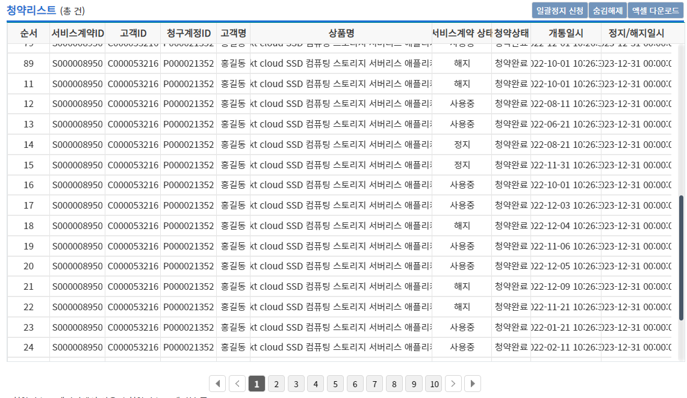

***
### BlcComponent
- AgGrid와 제목, 버튼을 포함한 정보 출력 폼
- subInfoTitleNm : 해당 오브젝트에 대한 제목명
- rowData : Ag Grid에 들어갈 행 데이터
- columnDefs : Ag Grid에 들어갈 컬럼 데이터
- selectBoxShow : 셀렉트 박스 출력 여부
- agGirdHeight : Ag Grid 셀의 높이
- cdGroup : 셀렉트 박스에 넣을 데이터에 대한 코드그룹
- headerColor: Ag Grid 헤더 색상
- btnName : 버튼에 대한 버튼명

**호출코드**

```aidl
        <blc-component
            :sub-info-title-nm="'요금정보'"
            :row-data="rowData"
            :column-defs="columnDefs"
            :select-box-show="false"
            :cdGroup="'optionsSearchDiv'"
            :btnName="'엑셀다운'"
            style="height: 110%"
        />
```

**예시**

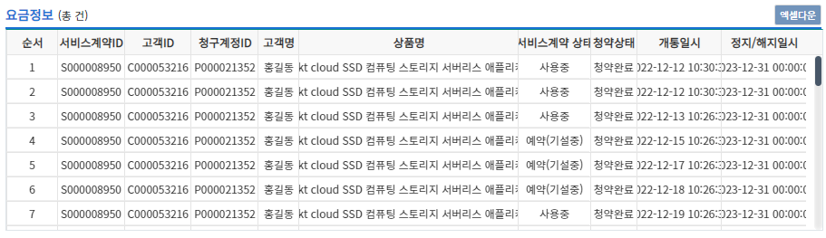

***
### CustInfoComponent
- 고객에 대한 정보를 보여주는 고객 정보 출력 테이블 폼
- custInfo : 고객에 대한 정보를 담은 객체

**호출코드**
```aidl
 <cust-info-component
    :custInfo="custInfo"
 />
```

**예시**

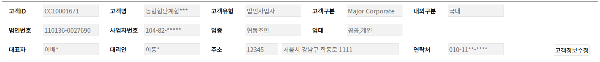

***
### CustRetvComponent
- 고객에 대한 정보를 조회하기 위한 고객 조회 폼
- cdGroup : 셀렉트 박스에 넣을 데이터에 대한 코드그룹
**호출코드**
```aidl
<cust-retv-component
    :cdGroup="cdGroup"
/>
```

**예시**

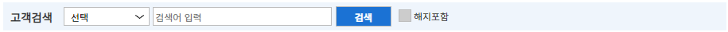

### FormDataComponent
설명

### FormDataPopupComponent
설명

***
### PostCodeComponent
- 주소 검색을 위해 만든 주소 조회 폼
- 주소를 검색하여 선택하면 상단의 테이블에 데이터가 들어가게 된다.
- 데이터는 @selectedJusoData를 통해 전달받는다. 전달받은 데이터는 selectedJuso 함수에서 변수에 넣어진다.

**호출코드**
```aidl
    <post-code-component
        @FormPopup="isPostCodeModalShow = false"
        @selected-juso-data="selectedJuso"
        :formDataPopupFrameWidth="'800px'"
        :PopupTitleMsg="'주소 검색'"
        :reqtype="'searchPostCode'"
        ref="PostCodeComponent"
        v-if="isPostCodeModalShow"
        :btnClicked ="0"
    />
```

**예시**

-초기상태

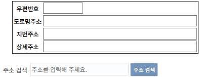

-주소 검색

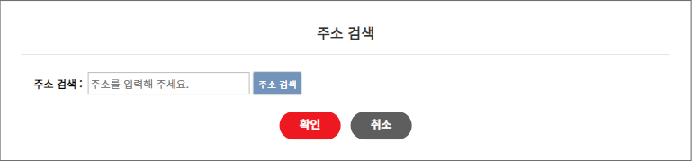

-검색 결과

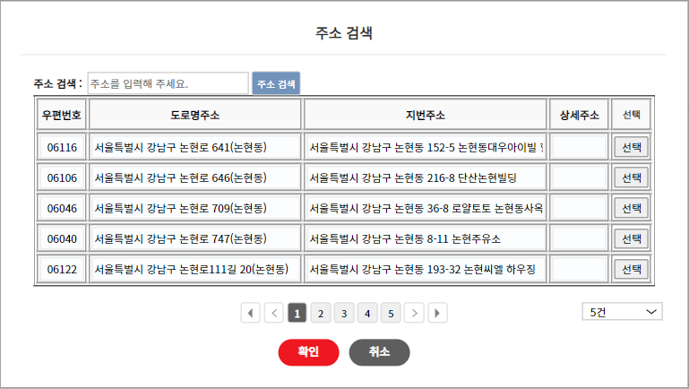

-결과 선택

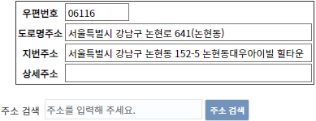


***
### RetvCondComponent
- 메뉴 관리 페이지에서 사용한 메뉴 조회 폼
- retvCondNm : 셀렉트 박스에 넣을 데이터에 대한 코드그룹
- selectCdGroup : 셀렉트 박스에 넣을 데이터에 대한 코드그룹
- selectDefltValue: 셀렉트 박스 기본 값

**호출코드**
```aidl
        <retv-cond-component
            :retvCondNm="'조회기준'"
            :selectCdGroup="'retvCond'"
            :selectDefltValue="'조회기준 선택'"
        />
```

**예시**

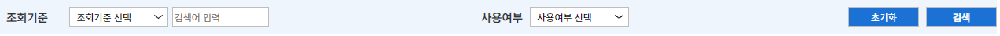

***
### SubsRetvComponent
- 청약 리스트 페이지에서 사용한 청약 조회 폼
- cdGroup : 셀렉트 박스에 넣을 데이터에 대한 코드그룹

**호출코드**
```aidl
        <subs-retv-component
            cd-group="'retvCond'"
        />
```

**예시**

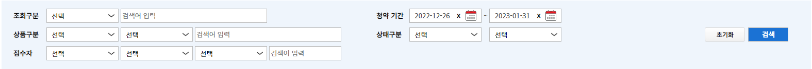

***
### UserAdmRetvComponent
- 사용자관리 페이지에서 사용한 사용자 조회 폼

**호출코드**
```aidl
 <user-adm-retv-component
    :cdGroup="cdGroup"
 />
```

**예시**


---

## VueX

## 참고
```
ag - grid : https://www.ag-grid.com/vue-data-grid/getting-started/
Vulidation : https://vuelidate-next.netlify.app/validators.html#minvalue
폴더 구조 : https://joshua1988.github.io/web-development/vuejs/vue-structure/
```
